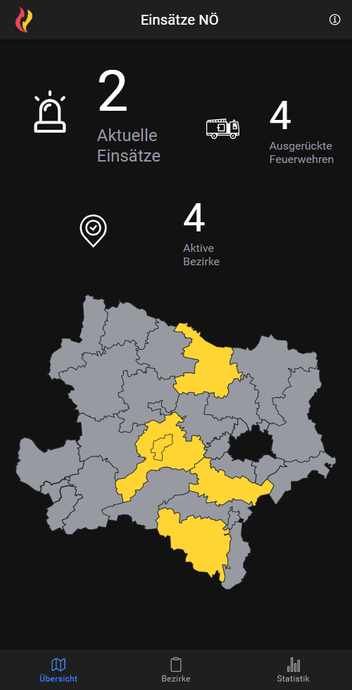

# Feuerwehreinsätze NÖ - FireService

The running web app can be found [here.](https://fireservice-app.herokuapp.com)
| | | |
|:-------------------------:|:-------------------------:|:-------------------------:|
|  mobile overview page |   districts list page| incident detail page|
|  statistics page |   imprint page||

Web- &amp; mobile app for displaying information about ongoing firefighter operations and statistics of operations in lower austria. The [Grisu NÖ - Mobile App](https://github.com/Grisu-NOE/mobile-app) was used as model.

## Description
This app was developed in the course of my bachelor thesis about reactive programming at the Johannes Kepler University (JKU). The thesis can be found [here.](thesis.pdf)

## Development server

Run `ng serve` for a dev server. Navigate to `http://localhost:4200/`. The application will automatically reload if you change any of the source files.

## Build

Run `ng build` to build the project. The build artifacts will be stored in the `dist/` directory.

## Running unit tests

Run `ng test` to execute the unit tests via [Karma](https://karma-runner.github.io).

## Running end-to-end tests

Run `ng e2e` to execute the end-to-end tests via a platform of your choice. To use this command, you need to first add a package that implements end-to-end testing capabilities.

## License
FireService is licensed under [MIT](https://choosealicense.com/licenses/mit/)
